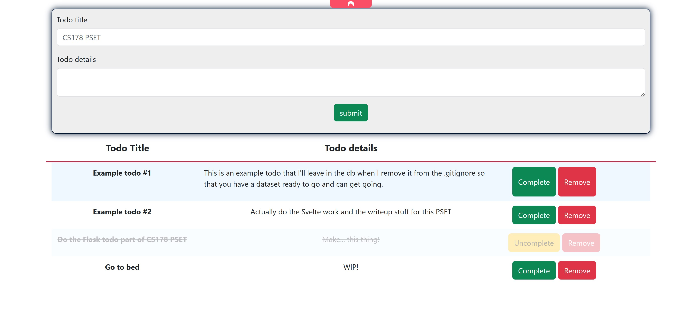

# CS178 PSET0b Writeup
## Andrew Holmes

Note: I wrote this in markdown, and used a website to convert to a PDF. You may prefer to read it at my [Github repo](https://github.com/ACHolmes/flask-todo), this file is `writeup.md`.

### Question 1: Svelte tutorial

**Work through this [Svelte.js tutorial](https://svelte.dev/tutorial/basics). long enough (at least through Sections 1 and 2) to compose 3-5 candidate “concepts” (as described in the first pre-class reading) by thinking of the Svelte framework design as a UI for specifying what you want the computer to do (as approximately described by the second pre-class reading). In your write-up, list these candidate concepts; give each abstract concept a name, provide one or more examples of its concrete syntax, and describe its purpose.**

1. Reactive statements in Svelte allow for the automatic updating of arbitray code blocks upon variable updates that are used within the code blocks. One example that I can imagine is for login elements, e.g.
```javascript
let logged_in=false;
$: if (logged_in) {
  alert('You are not logged in!');
}
```
This is a basic example, but you can totally imagine how logged in status of a user would be important to inform the display of pages (e.g. should login/register buttons appear in the top right, or a button to access your profile. That wouldn't require much modification from what I wrote above, which is pretty cool imo!)

2. Components are another important concept in Svelte (and in some other frameworks such as React). Stealing the definition they gave in the tutorial, a component is 'a reusable self-contained block of code that encapsulates HTML, CSS and JavaScript that belong together'. While the code for the component is 'self-contained', components can still behave differently based on their usage context (e.g. props, as seen in Svelte and React, or ContextProviders in React, I imagine there is similar in Svelte that I haven't got to). Thus a component is a block of code that defines a unit of functionality that is generally used more than once in an application but that can be flexible depending on its usage, and allows for development of different parts of the same page to occur largely independently and help make clear the logical and information flow of an application.

Here's an example of a profile button component, I imagine you'd normally rather have a like 'user profile image' but to make things simple let's imagine it's like StackOverflow where you might view user profiles by clicking on usernames instead:

```html
<script>
	export let name;
</script>

<style>
button {
	background-color: rgba(0, 70, 100, 0.4);
	border: none;
	text-decoration: underline;
}
</style>

<button>{name}'s Profile</button>
```

3. Events are another concept within Svelte which seem similar, but enhanced compared to regular HTML/CSS/JS. Event handlers such as `on: click` allow for another sense of reactivity, where user input (perhaps without changing a variable, store or other form of state except pressing a button) can have an effect on the webpage. Svelte seems to handle events differently to the regular `onclick` somehow, and until looking it up, I had no idea you could create custom events in [pure JS](https://developer.mozilla.org/en-US/docs/Web/Events/Creating_and_triggering_events), although again the [syntax in Svelte appears to be different](https://ashutosh.dev/comprehensive-guide-of-events-handling-in-svelte/). They yet again seem like another tool to allow for reactivity, perhaps notably across components, where other components can 'listen' for events dispatched from other components (in a similar manner to even Scratch!).

After some more reading, especially [this thread](https://www.reddit.com/r/sveltejs/comments/e9zqn1/why_use_custom_events/), the value of custom events to be able to pass information **up** to parent components makes a lot of sense. Here I've modified the code from the syntax link to implement the idea from the reddit link, which is a button to upload an image, and then upon succesful upload to the server, immediately display the image on the page above the input button:

```html
// App.svelte
<script>
    import Uploader from './uploader.svelte';

		let url = "";

    function handleMessage(event) {
        url = event.detail.url;
				alert('displaying newly uploaded image!')
    }

</script>

<main>
    <p> Event communication. </p>
    <hr/>
		
		<br>

    <Uploader on:message={handleMessage}/>

</main>

<style>
	main {
		text-align: center;
		padding: 1em;
		max-width: 240px;
		margin: 0 auto;
	}


	@media (min-width: 640px) {
		main {
			max-width: none;
		}
	}
</style>
```

```html
// uploader.svelte
<script>

    import { createEventDispatcher } from 'svelte'

    const dispatch = createEventDispatcher()

    function eventClickMe() {
			// Imagine some logic to dispatch the image to the server to store, and then take the URL
			// and send it back to the component above
        dispatch('upload', {
            // placeholder URL to Oshawott image!
            url: 'https://www.google.com/search?sca_esv=601586696&q=oshawott&tbm=isch&source=lnms&sa=X&ved=2ahUKEwij5tnS9PmDAxV-l4kEHZR8CjUQ0pQJegQIDRAB&biw=1528&bih=804&dpr=2.25#imgrc=xUmbrVcySLdAYM'
        });
    }
</script>

<button on:click={eventClickMe}>
    Click Me (Fake upload, would actually have a file upload)
</button>
```

**NOTE: I didn't read the event handler chapter of the tutorial when I wrote this, I have now, but the code provided at the link above is literally a copy of the tutorial website's code, so I just found mostly the same info at a different place.**

4. Properties, or `props` are also an important concept in Svelte (and again, React), as a mechanism to pass information down from parent components to their descendants. For example, you may have also state information stored at the top component (the App component I guess), and pass variables as properties to all its subcomponents to give them information as to how to behave (although this seems like it will have the same problem in React with 'prop drilling').

Here's a quick show of an example of props perhaps being useful, again in the context of users being logged in or not:

```html
<script>
	import Nested from './Nested.svelte';
</script>

<!-- some other components... -->
<Nested username={"ACHolmes"} />

<!-- Perhaps on another page, using an imagined username variable this time. -->
<Nested username={username}/>
```

```html
<script>
	export let username = '';
</script>

{#if username}
<p>Welcome, {username}</p>
{:else}
<p>You are not currently logged in</p>
{/if}
```

#### Old answer, can probably ignore

1. A 'login' concept is often important, to separate parts of systems that should only permit authenticated users' access. Here's a really basic login idea, just having a button that logs you in by giving you a unique username (basically a gensym username) and shows the current list of logged in users.

```html
<script>
	let count = 0;
	let logged_in_users = [];

	function login(user) {
		logged_in_users = [...logged_in_users, user];
		count += 1;
	}
</script>

<button on:click={() => login("user" + count)}>
	Clicked
</button>

<p>Logged in: {logged_in_users}</p>

```


### Question 2: Flask todo app

**Do the same (in your write-up, compose a corresponding list of candidate concepts) for any Flask Todo app tutorials, e.g., https://www.python-engineer.com/posts/flask-todo-app/. (Look for the one you like best!) Specify in your submission which one (or combination of tutorials) you found most helpful. In your write-up, provide a public link to Github or Github-equivalent with your code, and let us know if you got a to-do app up and working locally. Bonus points if you comment your code to indicate where your candidate concepts are instantiated!)**

I implemented a todo app using Flask and HTMX, you can view my [repository here](https://github.com/ACHolmes/flask-todo). I didn't use the tutorial, as per the next question, I have some experience in Flask and wanted to do this by myself as a way of learning HTMX, which I've never used. I have a working TODO app, with the capability to add, delete or mark todos as complete. Credits for resources I used beneath the concepts.



#### Concepts

1. Flask has the `template` concept, allowing for service of static or non-static pages via `render_template`. A template in turn consists of a combination of smaller concepts that `render_template` uses to construct a full webpage. Their purpose is to extend flask's ability to display content beyond (but still including) static pages, such that you can render information conditionally based on information from a database, session cookies, the current time or other similar information that can bring dynamic elements to a webpage (although note that I would distinguish these as 'dynamic' but not generally 'reactive' elements like in Svelte, as really this concept helps the first generation of the webpage, but does little to enhance the page upon interactions with the UI, unless they cause a redirect to another route, or there is javascript to add reactivity on top, which isn't Flask specific).

Here's my `layout.html` template for an example of a template, my `index.html` template is a bit long even if it's a better example, it's accessible in the GitHub repo though. Note the blocks providing spaces to insert dynamic content into the static template, but you can just render static templates/pages (and sometimes that's useful too).

```html
<!DOCTYPE html>
<html lang="en">
<head>
    <meta charset="UTF-8">
    <meta name="viewport" content="width=device-width, initial-scale=1.0">
    <title></title>
     
</head>
<body>
    
    
</body>


</html>
```

2. One such concept that might feature within a `template` is the concept of a `block`. Within a `layout` (or `parent` or similar notation) template, this is a space within the template for which an instantation (or `child`, any `template` that `extends` this template) of the template can use to render dynamic content. This distinguishes it from other parts of the template that are deliberately static, such as links to style documents or importing libraries that are needed across many webpages, or elements that should appear across all pages that build upon the template, often including UI staples such as navbars, footers and so on.

Example of the block concept from my todo app below. I want the meta tags to appear in all pages (even though in this case I only made one, I still default to making a `layout` template in case I want to extend the functionality at all with more pages), but the title should be unique depending on which page you're on, and I provide the `head` block in case a page needs additional style sheet imports or anything like that. In this case, I used bootstrap and `styles.css` to style the homepage, so those links are within the `head` `block` in `index.html`.

```html
<head>
    <meta charset="UTF-8">
    <meta name="viewport" content="width=device-width, initial-scale=1.0">
    <title></title>
     
</head>
```

```html

<!-- Bootstrap CSS -->
<link href="https://cdn.jsdelivr.net/npm/bootstrap@5.3.2/dist/css/bootstrap.min.css" rel="stylesheet" integrity="sha384-T3c6CoIi6uLrA9TneNEoa7RxnatzjcDSCmG1MXxSR1GAsXEV/Dwwykc2MPK8M2HN" crossorigin="anonymous">
<!-- index uses styles.css for additional styling -->
<link rel="stylesheet" href="{{url_for('static',filename='styles.css')}}" >

```

3. A concept I didn't use this time, but is often useful (and arguably I should have used) is the macro concept. This is similar to the component concept in other frameworks, wherein a small unit of repeated functionality is made its own component for easier re-use and reducing the need to update the same code in multiple places. Here's a (now disused) Flask macro example that I wrote when working on [cs50.ai](https://cs50.ai):

```html

    <div class="exchange">
        <div class="time">
          AI request sent at {{ created }}
        </div>
        <div class="prompt">
          {{ prompt }}
        </div>
        <hr>
        <div class="response">
          {{ response }}
        </div>
    </div>

```

The idea was to be able to render previous conversations easily in multiple locations, but we removed some hidden parts of the website that we used for development, so now the exchanges are only ever rendered like this on the home page that the user sees, so this macro doesn't actually reduce the complexity (since now its only in one place anyway, in a for loop on `index.html`), although arguably it might be still nice to separate it from the code that defines how the rest of `index.html` looks.

4. The concept of a `route` is also certainly important in Flask. In my head, a `route` is a link between a URL to a function to handle the actual implementation of the desired functionality. A route can provide a webpage, but also a route might just be an API route than returns data, or even just a redirect route that takes some information (e.g. a session cookie) and then directs the browser to another route for example. They also provide some restraints upon how a route can be accessed, such as which `methods` are permissible, or to determine if a user is already logged in (although I suppose that's not inherently tied to a route, that one is generally a decorator for a route in Flask).

Here's my main route to render the page:
```python
@app.route("/", methods=["GET"])
def index():

  # Get all the todos currently
  todos = db.session.execute(db.select(Todos)).scalars().all()

  # Use them to render template
  return render_template("index.html", todos=todos)
```

Here's a route that works with HTMX to just return a component! (see next thing for what `render_complete_todo` etc do)
```python
@app.route("/complete", methods=["POST"])
def mark_complete():

  # Update todo in db
  todo_id = request.form.get("complete")
  todo = db.session.execute(db.select(Todos).where(Todos.id==todo_id)).scalar()
  todo.complete = not todo.complete
  db.session.commit()

  # Send back appropriate HTML element
  if todo.complete:
    return render_complete_todo(todo)
  else:
    return render_incomplete_todo(todo)
```

5. This one isn't for Flask, but I used [HTMX](https://htmx.org/) to try it out because I was super curious. One concept from HTMX I would describe as `swappable components` - HTMX introduces the `hx-swap` attribute, which allows you to swap some current element in the DOM with the returned HTML/HTMX from the server. Just looking at one of my todos in `index.html`:

```html
<div class="row todo-item {{'todo-complete' if todo.complete}}" data-todo-id={{todo.id}}>
        <div class="col-3 d-flex justify-content-center">
          <b>{{ todo.title }}</b>
        </div>
        <div class="col-6 d-flex justify-content-center">
          <p>{{ todo.details }} </p>
        </div>
        <div class="col-2 d-flex justify-content-center">
          <div class="button-container">
            
            <button class="btn btn-warning" value={{todo.id}} type="submit" name="complete" hx-post="/complete" hx-target="closest .todo-item" hx-swap="outerHTML">
              Uncomplete
            </button>
            
            <button class="btn btn-success" value={{todo.id}} type="submit" name="complete" hx-post="/complete" hx-target="closest .todo-item" hx-swap="outerHTML">
              Complete
            </button>
            
            <button class="btn btn-danger" value={{todo.id}} type="submit" name="remove" hx-post="/remove" hx-target="closest .todo-item" hx-swap="outerHTML"> Remove </button>
          </div>
        </div>
      </div>
```

Let's look at the final button in any todo, the delete button. When it is clicked, it calls the `/remove` route with a `POST` request. Its target is the closest `todo-item`, which will be the parent div that contains the whole todo itemrow. And `hx-swap` tells it to swap that current element's outerHTML (i.e. the entire row) with what is returned by the server, which in `app.py` is just an empty string, in effect deleting the row!


#### Misunderstood the assignment, these were my concepts for the todo app rather than Flask, Elena told me to leave them here anyway.

1. The **add** concept is probably the most obvious concept here, with the ability to add to a list a fundamental component of a todo list. I have it visually signalled by a bootstrap form element (with classic white background text boxes with placeholders for input, and a green 'submit' style button to add).
2. In turn, the **delete** concept gives the possibility to permanently delete a todo item, again visually signalled with the classic 'big red button' signifying dangerous or destructive actions.
3. The **complete** concept allows for the completion or 'ticking off' of todos, as you would do with a physical todo list. It differs from the deletion concept since many (myself included) find it satisfying and motivating to be able to see not just tasks that we need to do, but also those which we have already completed (or perhaps are in progress, which I don't have here).

#### Other Credits

I used the [bootstrap 5.3 documentation](https://getbootstrap.com/docs/5.3/getting-started/introduction/) extensively for styling. Note that some of the colors I used (e.g. #031633) were taken from bootstrap colors via inspect element, since for some reason `--bs-primary-bg-subtle` didn't work (following same example).

I used [HTMX's documentation](https://htmx.org/) to try to learn HTMX.

I had to remind myself how to update data using flask_sqlalchemy, which I found in their documentation [here](https://flask-sqlalchemy.palletsprojects.com/en/3.1.x/quickstart/#query-the-data).

I used some of the work I've done for CS50 recently to speed up setting up the flask, a lot of `app.py` up until line 29 is copied directly from a (currently unreleased, else I would link it for credit) project I worked on over the winter break for cs50.


### Question 3: Bugs, prior experience

**In your write-up, for each of the two frameworks, tell us about a code or mental bug that you debugged, and how you did it (or couldn’t and what you tried). Did anyone within or beyond the class help you, and if so, how? (We're a learning community! Debugging is part of the process, and it's good to help each other. Give credit generously.)**

**Tell us what prior experiences (if any) you have with that framework.**

#### Bugs/challenges
* Svelte

  * The array updating system threw me (and I think many others). Firstly I immediately after the tutorial got it wrong and got confused, and had to go and re-read the tutorial. Nonetheless, I still feel like I have a mental bug or at least mental fear of doing the neccessary steps (e.g. `arr.push(obj); arr = arr` or the spread syntax), since it seemed extremely inefficient in my head. However, I went digging and found that the spread operator creates shallow copies ([see here for spread documentation](https://developer.mozilla.org/en-US/docs/Web/JavaScript/Reference/Operators/Spread_syntax), copying an array section) which allays some performance worries with that method, and also realizing that actually since these are `.svelte` files that are compiled, I know from CS153 that finding these redundant statements (`x = x`) is actually really pretty easy for a compiler, so actually although it looks a bit silly, I'm sure that the compiler is actually optimizing this behavior so that I (probably) don't have to worry about every array push operation causing the allocation of an entirely new array.

* Flask todo app (Note: I've used Flask so much that I didn't really hit any Flask bugs directly, so I'm going to talk about a bug with my CSS understanding and HTMX, both of which I encountered while working on the todo app)

  * I wanted completed todos to be fuzzed out and have text content displayed with a strike-through. Styling the outer div (`.todo-item`) cascaded that `text-decoration` down to all lower elements, including the buttons. I was hopeful that there was a way to exlcude certain children elements, but after a quick Google and reading this Stack Overflow thread: [text-decoration bug](https://stackoverflow.com/questions/1261955/inherited-text-decoration-style), it became clear that isn't possible, and I had to tinker with both the HTML and CSS to get the effect I wanted.

  * I also wanted to be able to complete tasks via a built-in HTML `checkbox` `input` type, but combining this with HTMX was causing me issues. This is my first time using HTMX, so there may be a way around it, but I couldn't find it in the documentation or online, and I briefly tried using ChatGPT but I think HTMX is still too new/niche to provide any meaningful aid currently. I actually created a Stack Overflow account to see if I could get some help, and posted a [question here](https://stackoverflow.com/questions/77862122/htmx-interaction-with-checkboxes?noredirect=1#comment137270853_77862122), and I've just seen that someone replied with what seems like it could solve my problems! I had already shifted to just using a more conventional button, but I'll give their suggestion a try on a branch and see if it does solve the issue so that I can mark it as correct on the thread.

#### Prior experience

I have essentially no prior experience at all with Svelte, I've looked at one page of svelte code in the [classes.wtf repository](https://github.com/ekzhang/classes.wtf) because I was curious how they handled such fast course search, but I've looked at it for no more than 10 minutes before.

Flask is a very different story - I first used Flask as a CS50 student in Fall 2020, and I have TF'd the course every Fall semester since, so I have quite a lot of experience with the basics of using Flask. In addition, last summer I worked for CS50 as a software engineer, where I helped build [cs50.ai](https://cs50.ai/) (GitHub login required to properly use), which used Flask. Finally, I again worked for CS50 for the January term for two weeks before this spring semester started, working on a new project as a full-stack web engineer, again using Flask for the backend. I was more focused on the frontend (pure JS, we are always constrained to use Flask + JS so that future maintainers of all of CS50's tools only need to learn one set of tools), but did work on the backend/with flask for a few days, especially at the beginning, before shifting focus to the frontend and writing primarily JavaScript.


### Question 4: Comparisons & Judgements


* **In your write-up, tell us what's most usable about each and least usable about each for you, given your prior programming experiences.**
* **Tell us two similarities and two differences between the two framework**
* **Tell us which framework you would prefer using in the future, given a choice, and why.**

#### Answers

* Svelte
  * Svelte's reacitivity capabilities seem, from a first play, super nice. I don't particularly like the `$:` syntax, but I guess it is short and doesn't clash hugely elsewhere, but I love how it functions and it seems to provide significant power to the developer to quickly create and easily manage shared state that might be displayed in multiple places/modalities.
  * On the other hand, I generally find JavaScript a nuisance. I have never used a NoSQL database, so I always find it hugely frustrating to incur the cost of the server serializing an object to JSON, and then the frontend deserializing it to be able to modify HTML/display content. It's lack of safety around `NaN`, `null` and `undefined` are a constant thorn, and I think the console error messages are generally very low quality and find debugging a huge chore in the language.
* Flask
  * The main appeal of Flask is the generally widely accepted usability of Python itself, which lots of software engineers are familiar with and allows for generally quick prototyping. I am also extremely biased as I've used it a lot, so I find it intuitive!
  * I think some of the flask add-ons are not as great as other frameworks. In particular, `flask_sqlalchemy` is somewhat confusing and not the best documented in my opinion.
  * I would also say that using Python is also one of its main disadvantages - having a full JS stack (e.g. MERN) has the appeal of uniformity in language, even if React code (especially with JSX, styled-components) looks nothing like Express code, it is still fundamentally the same language so for small teams, those may be eaiser to handle/train/learn.
  * Flask also generally relies on `render_template` for displaying pages, and this then almost necessitates a basic familiarity with `Jinja`, thus Flask actually introduces two languages into your stack, which may feel like one or two more languages than desired.

**Similarities**:

1. Both have some sort of component capability, with Svelte's closer to what I know from React components (e.g. `import Nested from './Nested.svelte'` from the tutorial), while Flask provides macros (`{ % macro %}` etc) in Jinja along with a templating system (``, `` etc) to reduce copy-paste code and having to update code duplicates in multiple locations.
2. Both can directly modify the DOM, Flask via `render_template` and Svelte directly via HTML/CSS/JS.
3. Both seem to be relatively beginner-friendly, as compared to frameworks such as Angular or using some of the trickier backend tools like Rocket (Rust).
4. Both have a system of inheritance for displayed components, with Svelte's nested components and Flask's `extend`, `macro` and `block` capabilities.

**Differences**:

1. Svelte seems to place great emphasis on reactivity and making handling DOM updates as easy as possible. Flask out of the box does almost nothing to help with reactivity beyond regular HTML/JS capabilities.
2. Svelte seems to provide out of the box modifications to HTML that Flask doesn't, for example, `<button on:click={incrementCount}>` looks similar to jinja, except `on:click` seems to be a Svelte-specific handler which I guess is pre-compiled to a regular HTML `onclick` attribute, and I'm not even sure why `incrementCount` needs to be in `{}`, perhaps to enforce scoping or perhaps this is just Svelte's syntax.
3. Svelte requires compilation to raw JS before it can be deployed/ran, which is just an extra step over `flask run`.

#### Rather use

I have a good amount of experience with Flask, so in terms of getting going, Flask would certainly make my life easier. However, Svelte does seem to handle state super elegantly with its store system and overall looks very appealing, I would quite like to try it out. I would like to try to do at least one project with Svelte, but there's always the room to use both since Flask is primarily (in my eyes) a backend framework while Svelte is a frontend framework (or perhaps library? Not sure the correct terminology). In the long run, I will probably continue to use Flask due to my previous experience using it.